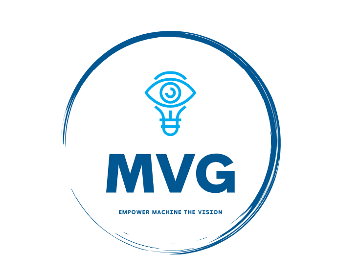

# [Oulu MVG Research Group DATASET managements](https://www.oulu.fi/en/university/faculties-and-units/faculty-information-technology-and-electrical-engineering/center-machine-vision-and-signal-analysis)



The **Oulu CMV DATASET managements** empowers our group members to easily access and visit all the existing datasets (both our own datasets and other popular benchmark datasets) rooted at the CSC platform ⭐⭐⭐⭐⭐.

## 1. Introduction

We store the datasets on the CSC platform in **two servers** (Puhti and Allas) 🐧

**a. [Allas](https://docs.csc.fi/data/Allas/accessing_allas/) for cold storage**

Allas is for **long-term storage/backup**. The data won't be deleted that easily; unstructured data is accepted (you can put all your trash here).
- [How to upload data to Allas](https://docs.csc.fi/data/Allas/using_allas/cyberduck/)

**b. [Puhti](https://docs.csc.fi/computing/systems-puhti/)/Mahti for hot storage**

Puhti/Mahti is for **handy access for the running experiments**. The data WILL be deleted easily (90 days); unstructured data is NOT accepted (big chunk file is better); fast access
- [How to upload data to Puhti](https://docs.csc.fi/data/moving/graphical_transfer/)

**Tips**
- Make sure that you upload your datasets to **both servers for the first time**.
- [Converting between Allas and Puhti/Mahti](https://docs.csc.fi/data/Allas/accessing_allas/#accessing-allas-in-the-csc-computing-environment-and-other-linux-platforms)


## 2. Dataset storage arrangement

So far, we have applied two projects to store the datasets (**MVG_dataset1** and **MVG_dataset2**); we will apply for more depending on the final space used.

- MVG_dataset1 -> face 
- MVG_dataset2 -> body
- MVG_dataset3 -> EmotionAI
- MVG_dataset4 -> General

Below is the detailed data arrangement:

**a. MVG_dataset1** 

Project name: MVG_dataset1

Project ID: project_2009201

Content: face datasets

Puhti address:/scratch/project_2009201/

Allas address:project_2009201:default:username

Folder hierarchy (people in charge):

```bash
.
├── FER (Xingxun)
│   └── ...
├── rPPG (Marko)
│   └── ...
├── Antispoofing (Marko)
│   └── ...
├── Forgery (Yang)
│   └── ...
├── Others (Haotian)
│   └── ...
└── MER (Yante)
    ├── SMIC
    └── CASME

```

**b. MVG_dataset2** 

Project name: MVG_dataset2

Project ID: project_2009202

Content: body datasets

Puhti address:/scratch/project_2009202/

Allas address:project_2009202:default:username


Folder hierarchy (people in charge):

```bash
.

├── Action (Atif)
│   └── ...
├── Gesture (Atif)
│   └── ...
├── Other (Atif)
│   └── ...
└── MGs (Haoyu)
    ├── iMiGUE 
    └── SMG (70G)

```

**c. MVG_dataset3**  (TBD)

Project name: MVG_dataset3

Content: EmotionAI-related datasets

Folder hierarchy (people in charge):

```bash
.
├── EmotionAI (Hanlin)
│   └── ...
├── Sundown (Qianru)
│   └── ...

```


**d. MVG_dataset4** (TBD)

Project name: MVG_dataset4

Content: general datasets

Folder hierarchy (people in charge):

```bash
.
├── Image
    ├── ImageNet (150G)
    └── CIFAR100
├── others
│   └── ...

```

## 3. TO DO LIST
- [X] Basic structure of the dataset management
- [X] Assign the correspondent of each project space
- [X] Finalize the dataset folder structure
- [ ] Confirm all the dataset sizes
- [ ] Complete the dataset credits
- [ ] Upload all the datasets to Allas
- [ ] Upload all the datasets to Puhti/Mahti(/scratch)
- [ ] Apply for extra space for extremely large datasets, like EmotionAI
- [ ] Add more documents 


## 4. Maintenance instructions
- 👉 If you need to change the high-level dataset structure (like Face, General), please contact chen.haoyu@oulu.fi so we can update this README to make it consistent.
- 🚀 [Do with BIG file chunk](https://docs.csc.fi/support/faq/local_scratch_for_data_processing/) NEVER upload a huge amount of files; instead, upload a big compressed file (you can process the data later in your own scratch space)
- ⬆️ **Updating of both servers?** You don't need to make the content of the two server exactly the same, but make sure the folder level arrangement is consistent.
- 🗳  [GDPR regulation](https://docs.csc.fi/accounts/when-your-project-handles-personal-data/) Basically you don't need to take extra actions (the GDPR form was filled out when applying for the space)


## 5. Dataset credits

Please add or update the dataset links you are in charge of here.

- MG
  - [iMiGUE](https://github.com/linuxsino/iMiGUE)
  - [SMG](https://github.com/mikecheninoulu/SMG)
- ME
